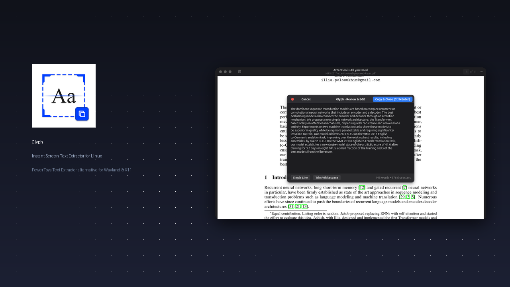

# Glyph 🔍

<div align="center">
  
  <h3>Lightning-Fast Screen Text Extractor for Linux</h3>
  <p>PowerToys Text Extractor alternative designed natively for Wayland and X11 desktops.</p>

[](https://github.com/muhaideennausar/glyph-text-extractor/actions)
[](LICENSE)
[](#)
[](#)

</div>

---

<div align="center">
  
</div>

---

## ⚡ Why Glyph?

- **Instant Execution:** Snappy background pipeline with in-memory image streaming and lazy UI loading (~20ms latency).
- **Two Operating Modes:**
  - **Mode A (Instant):** Crop a screen region and have text copied directly to your clipboard with a desktop notification.
  - **Mode B (Review & Edit):** Clean, inspect, join broken PDF lines, or trim whitespace in a native Libadwaita modal before copying.
- **Compositor Agnostic:** Works seamlessly on GNOME, KDE Plasma, Hyprland, Sway, XFCE, and i3 via standard XDG Desktop Portals or native CLI grabbers (`grim`, `slurp`, `maim`, `scrot`).
- **Offline & Private:** Zero telemetry, no cloud APIs, private `0o600` temporary capture permissions with instant file shredding.
- **Resource Light:** Consumes < 35MB RAM. Runs smoothly even on low-spec hardware.

---

## 📸 Screenshots

|                             Mode A: Instant Screen Crop                              |                        Mode B: Interactive Review & Format                         |
| :----------------------------------------------------------------------------------: | :--------------------------------------------------------------------------------: |
|  |  |

---

## 📦 Installation

### Option 1: Native Local Installer (Recommended for development)

Clone the repository and run the installer:

```bash
git clone https://github.com/muhaideennausar/glyph-text-extractor.git
cd glyph-text-extractor
./install.sh
```

This installs `glyph` into `~/.local/bin/glyph`, installs the desktop entry, and registers high-resolution and symbolic icons into your desktop environment.

Make sure dependencies are installed on your distribution:

| Distribution                   | Command                                                                                                                               |
| :----------------------------- | :------------------------------------------------------------------------------------------------------------------------------------ |
| **Ubuntu / Debian / Pop!\_OS** | `sudo apt install tesseract-ocr tesseract-ocr-eng wl-clipboard python3-pil python3-gi gir1.2-gtk-4.0 gir1.2-adw-1`                    |
| **Fedora**                     | `sudo dnf install tesseract tesseract-langpack-eng wl-clipboard python3-pillow python3-gobject gtk4 libadwaita`                       |
| **Arch / Manjaro**             | `sudo pacman -S tesseract tesseract-data-eng wl-clipboard python-pillow python-gobject gtk4 libadwaita`                               |
| **openSUSE**                   | `sudo zypper install tesseract-ocr tesseract-ocr-traineddata-english wl-clipboard python3-Pillow python3-gobject gtk4 libadwaita-1-0` |

### Option 2: Flatpak (Flathub)

```bash
flatpak install flathub io.github.glyph.Glyph
flatpak run io.github.glyph.Glyph
```

---

## ⌨️ Set Up Global Keyboard Shortcuts

To make Glyph feel like a built-in OS tool (similar to PowerToys Text Extractor on Windows):

### GNOME / Ubuntu (Wayland or X11)

1. Open **Settings** → **Keyboard** → **View and Customize Shortcuts** → **Custom Shortcuts**.
2. Click **+** to add a new shortcut:
   - **Instant Capture (Mode A):**
     - **Name:** `Glyph Text Extractor`
     - **Command:** `/home/<your-user>/.local/bin/glyph --grab`
     - **Shortcut:** <kbd>Super</kbd> + <kbd>Shift</kbd> + <kbd>T</kbd>
   - **Review & Edit (Mode B):**
     - **Name:** `Glyph Review Editor`
     - **Command:** `/home/<your-user>/.local/bin/glyph --grab --edit`
     - **Shortcut:** <kbd>Super</kbd> + <kbd>Shift</kbd> + <kbd>E</kbd>

### Hyprland (`~/.config/hypr/hyprland.conf`)

```ini
bind = SUPER SHIFT, T, exec, glyph --grab
bind = SUPER SHIFT, E, exec, glyph --grab --edit
```

### Sway (`~/.config/sway/config`)

```ini
bindsym $mod+Shift+t exec glyph --grab
bindsym $mod+Shift+e exec glyph --grab --edit
```

### KDE Plasma

1. Open **System Settings** → **Shortcuts** → **Custom Shortcuts**.
2. Add **Edit** → **New** → **Global Shortcut** → **Command/URL**.
3. Set Trigger to <kbd>Meta</kbd> + <kbd>Shift</kbd> + <kbd>T</kbd> and Command to `glyph --grab`.

---

## 🛠️ CLI Usage & Options

```bash
# Instant interactive screen capture and copy (Mode A)
glyph --grab
glyph -g

# Interactive screen capture with review & edit modal (Mode B)
glyph --grab --edit
glyph -g -e

# Extract text directly from an existing image
glyph -f document_scan.png

# Extract in another language (requires tesseract-ocr-<lang>)
glyph --grab -l deu   # German
glyph --grab -l fra   # French
glyph --grab -l spa   # Spanish

# Custom Page Segmentation Mode (PSM)
glyph --grab --psm 7  # Single text line

# Suppress desktop notifications
glyph --grab --no-notify

# Debug diagnostics (detailed image and OCR logs)
glyph --grab --debug
```

---

## ⚙️ Configuration (`~/.config/glyph/config.json`)

Glyph follows the XDG Base Directory specification. Configuration settings are automatically created on first launch:

```json
{
  "general": {
    "default_mode": "instant",
    "notify_on_success": true,
    "notify_on_empty": true
  },
  "ocr": {
    "default_engine": "tesseract",
    "default_language": "eng",
    "default_psm": 6
  },
  "editor": {
    "window_width": 640,
    "window_height": 440,
    "show_char_count": true
  }
}
```

Precedence order:
`CLI Flags > ~/.config/glyph/config.json > Factory Defaults`

---

## 🧪 Testing

Glyph comes with a comprehensive unit and edge-case test suite covering corrupt headers, 0-byte aborts, 100MP gigapixel bombs, portal timeouts, and multi-line formatting:

```bash
PYTHONPATH=src python3 -m unittest discover tests -v
```

---

## 📄 License

GPL-3.0-or-later. See [LICENSE](LICENSE) for details.
