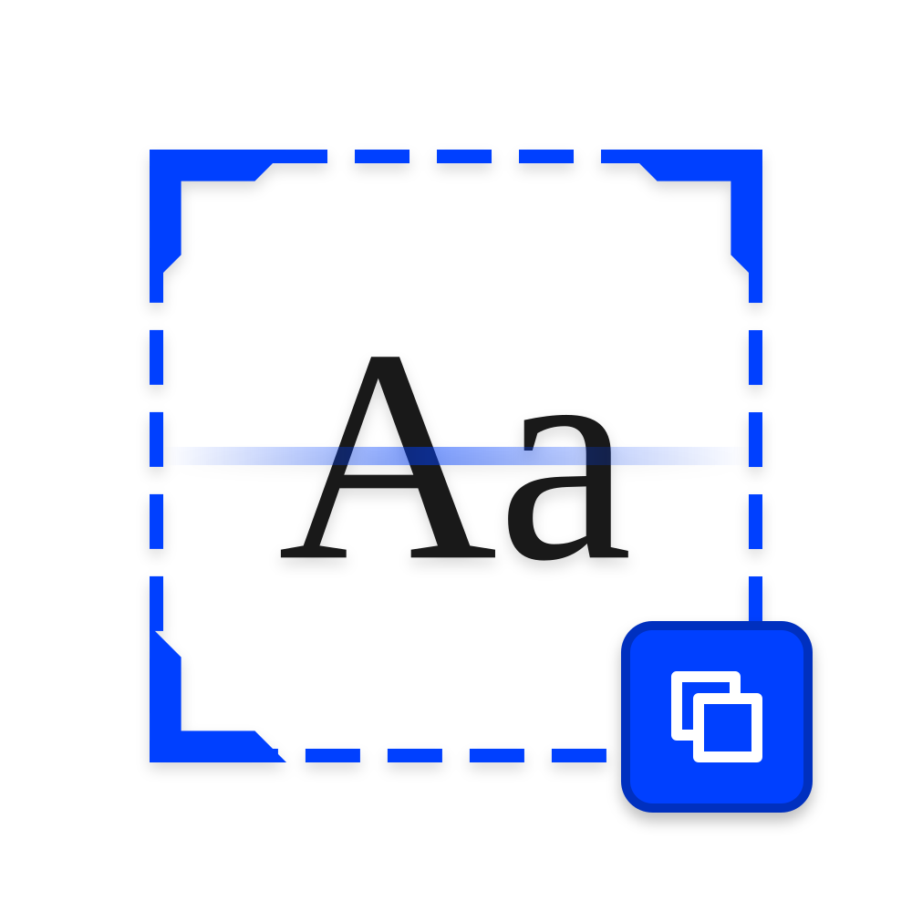
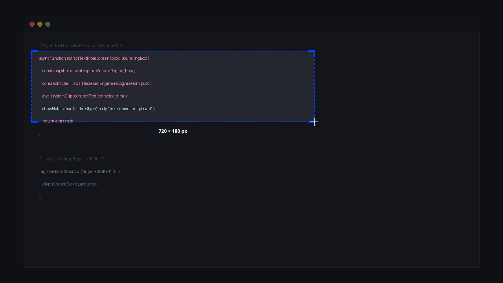
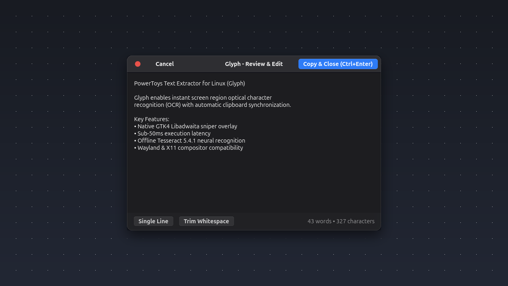

# Glyph - Text Extractor 🔍

<div align="center">
  
  <h3>Lightning-Fast Screen Text Extractor for Linux</h3>
  <p>PowerToys Text Extractor alternative designed natively for Wayland and X11 desktops.</p>

[](https://github.com/muhaideennausar/glyph-text-extractor/actions)
[](https://github.com/muhaideennausar/glyph-text-extractor/releases/latest)
[](LICENSE)
[](CHANGELOG.md)
[](#)
[](#)

</div>

---

<div align="center">
  
</div>

---

## ⚡ Why Glyph - Text Extractor?

- **Instant Execution:** Snappy background pipeline with in-memory image streaming and lazy UI loading (~20ms latency).
- **Two Operating Modes:**
  - **Mode B (Review & Edit — Default):** Clean, inspect, join broken PDF lines, or trim whitespace in a native Libadwaita modal before copying. Triggered by default with `Super + Shift + T` or `glyph --grab`.
  - **Mode A (Instant Extract):** Crop a screen region and have text copied directly to your clipboard with a desktop notification (`Super + Shift + I` or `glyph --grab --instant`).
- **Geometry-Aware Smart PSM Detection:** Dynamically switches Page Segmentation Mode based on crop dimensions:
  - Single-line crops (aspect ratio $\ge 3.0$): Automatically runs **PSM 7** (single line) to prevent broken URLs or commands.
  - Standard text snippets (height $\le 300\text{px}$): Runs **PSM 6** (uniform block).
  - Multi-paragraph / page clippings: Runs **PSM 3** (full automatic page segmentation).
- **Next-Gen Preprocessing:**
  - **Otsu Binarization Fallback:** Multi-pass recognition cascade triggers an automated Otsu binarization pass on low-contrast or noisy backgrounds.
  - **Unsharp Mask Edge Sharpening:** Sharpens fine antialiased screen fonts for crystal-clear character boundaries.
- **Compositor Agnostic:** Works seamlessly on GNOME, KDE Plasma, Hyprland, Sway, XFCE, Cinnamon, and i3 via standard XDG Desktop Portals or native CLI grabbers (`grim`, `slurp`, `maim`, `scrot`).
- **Reliable Desktop Notifications:** Sanitized FreeDesktop notifications with XML/HTML character escaping and branded application icons across all desktop environments.
- **Offline & Private:** Zero telemetry, no cloud APIs, private `0o600` temporary capture permissions with instant file shredding.
- **Cross-Distro Conflict Prevention:** Built-in dual-installation diagnostic warnings alert you if a user-space pip binary is shadowing system package installations.
- **Resource Light:** Consumes < 35MB RAM. Runs smoothly even on low-spec hardware.

---

## 📸 Screenshots

### Mode A: Instant Sniper Screen Crop

Crop any portion of your screen to extract and copy text instantly to your clipboard.

<div align="center">
  
</div>

### Mode B: Interactive Review & Formatting Modal

Clean, inspect, join broken PDF lines, and trim whitespace before copying.

<div align="center">
  
</div>

---

## 📦 Multi-Distro Installation

Glyph is engineered to install natively across all major Linux distributions.

### Option 1: Debian / Ubuntu / Linux Mint / Pop!\_OS (.deb)

Download the latest `.deb` package from the official [Releases](https://github.com/muhaideennausar/glyph-text-extractor/releases) page and install it with one command (all dependencies resolve automatically):

```bash
sudo apt install ./glyph-text-extractor_*_all.deb
glyph --setup-shortcuts
```

### Option 2: Fedora / RHEL / CentOS / Rocky (.rpm)

Download the latest `.rpm` package from the [Releases](https://github.com/muhaideennausar/glyph-text-extractor/releases) page:

```bash
sudo dnf install ./glyph-text-extractor-*.rpm
glyph --setup-shortcuts
```

_On openSUSE:_

```bash
sudo zypper install ./glyph-text-extractor-*.rpm
glyph --setup-shortcuts
```

### Option 3: Arch Linux / Manjaro / EndeavourOS

Clone the repository and build via `makepkg`:

```bash
git clone https://github.com/muhaideennausar/glyph-text-extractor.git
cd glyph-text-extractor/packaging/arch
makepkg -si
glyph --setup-shortcuts
```

### Option 4: Universal Python (`pipx` on any Linux distro)

```bash
pipx install git+https://github.com/muhaideennausar/glyph-text-extractor.git
glyph --setup-shortcuts
```

### Option 5: Universal Portable Release Archive (.tar.gz)

Download `glyph-*-linux-portable.tar.gz` from [Releases](https://github.com/muhaideennausar/glyph-text-extractor/releases), extract and run the bundled installer:

```bash
tar -xzf glyph-*-linux-portable.tar.gz
cd glyph-*-linux-all
./install.sh
```

### Option 6: Native Local Installer (From Source)

```bash
git clone https://github.com/muhaideennausar/glyph-text-extractor.git
cd glyph-text-extractor
./install.sh
```

Ensure system dependencies are installed:

| Distribution                   | Command                                                                                                                                                 |
| :----------------------------- | :------------------------------------------------------------------------------------------------------------------------------------------------------ |
| **Ubuntu / Debian / Pop!\_OS** | `sudo apt install tesseract-ocr tesseract-ocr-eng wl-clipboard python3-pil python3-gi gir1.2-gtk-4.0 gir1.2-adw-1`                                      |
| **Fedora**                     | `sudo dnf install tesseract tesseract-langpack-eng wl-clipboard python3-pillow python3-gobject gtk4 libadwaita`                                         |
| **Arch / Manjaro**             | `sudo pacman -S tesseract tesseract-data-eng wl-clipboard python-pillow python-gobject gtk4 libadwaita`                                                 |
| **openSUSE**                   | `sudo zypper install tesseract-ocr tesseract-ocr-traineddata-english wl-clipboard python3-Pillow python3-gobject typelib-1_0-Gtk-4_0 typelib-1_0-Adw-1` |

### Option 7: Flatpak / Flathub

Glyph provides a native Flatpak manifest ([`io.github.muhaideennausar.Glyph.yaml`](io.github.muhaideennausar.Glyph.yaml)). For local building and submitting to the Flathub store, refer to the [Flathub Publishing Guide](docs/FLATHUB_GUIDE.md).

---

## 🔄 Updating & Upgrading Glyph

To upgrade Glyph when a new version is released:

### Debian / Ubuntu / Linux Mint / Pop!\_OS (.deb)

Download the updated `.deb` package from [Releases](https://github.com/muhaideennausar/glyph-text-extractor/releases) and upgrade:

```bash
sudo apt install --reinstall ./glyph-text-extractor_*_all.deb
# Or via dpkg:
sudo dpkg -i ./glyph-text-extractor_*_all.deb
```

### Fedora / RHEL / openSUSE (.rpm)

Download the updated `.rpm` package and upgrade:

```bash
sudo dnf upgrade ./glyph-text-extractor-*.rpm
# On openSUSE:
sudo zypper update ./glyph-text-extractor-*.rpm
```

### Arch Linux / Manjaro / EndeavourOS

Pull the latest source and rebuild:

```bash
cd glyph-text-extractor
git pull origin main
cd packaging/arch && makepkg -si
```

### Python / pipx

```bash
pipx upgrade glyph-text-extractor
# Or reinstall latest from GitHub:
pipx install --force git+https://github.com/muhaideennausar/glyph-text-extractor.git
```

### From Source or Portable Archive

```bash
git pull origin main
./install.sh
```

---

## ⌨️ Intelligent Global Shortcuts

Glyph includes an automated cross-desktop shortcut setup engine that runs across **GNOME, KDE Plasma, Cinnamon, MATE, XFCE, and tiling WMs (Hyprland, Sway, i3)**:

```bash
glyph --setup-shortcuts
```

- **Collision Detection:** If a key combination (e.g. `<Super><Shift>t`) is already claimed by another application, Glyph retrieves and displays the conflicting shortcut's name, command, and key, and asks for your permission before replacing it.
- **Permission Prompt:** If no collision exists, it still asks for your confirmation before appending the shortcut.
- **Non-Interactive Mode:** For automated scripts, run with `-y`: `glyph --setup-shortcuts -y`.
- **Clean Removal:** Run `glyph --remove-shortcuts` to deregister shortcuts at any time.

---

## 🔐 First-Time Launch & Wayland Permissions

When you trigger Glyph - Text Extractor (`glyph --grab`) for the first time on modern GNOME (Ubuntu 24.04+, Fedora 39+, etc. running Wayland), your desktop will present a system security dialog:

<div align="center">
  <blockquote>
    <strong>Allow Apps to Take Screenshots?</strong><br />
    <em>An app wants to take screenshots at any time</em><br />
    <code>[Deny]</code> &nbsp; <code><strong>[Allow]</strong></code>
  </blockquote>
</div>

### Why does this appear?

- **Wayland Security Isolation:** On modern Wayland compositors, applications are strictly isolated from one another so that background programs cannot silently spy on your screen, passwords, or personal data.
- **Silent Sniper Snapshot:** To provide an instant screen freeze with Glyph - Text Extractor's custom GTK4 sniper overlay—bypassing GNOME's camera shutter sound, flash, and duplicate OS notifications—Glyph requests a background screenshot via the standard XDG Desktop Portal (`org.freedesktop.portal.Screenshot`).
- **One-Time Authorization:** Click **Allow**. GNOME permanently remembers your decision in **Settings → Privacy & Security → Screen Capture**. All future extractions will launch instantly without any prompts.

> [!TIP]
> If you ever accidentally click "Deny", you can re-enable permission at any time by opening **Settings → Privacy & Security → Screen Capture** and enabling the permission.

---

## ⌨️ Manual Global Keyboard Shortcuts (Optional)

> [!TIP]
> You do not need to configure shortcuts manually! Simply run `glyph --setup-shortcuts` in your terminal, and Glyph will automatically detect your desktop environment and configure shortcuts with collision detection.

If you prefer to configure shortcuts manually via your desktop environment settings:

### GNOME / Ubuntu / Fedora (Wayland or X11)

1. Open **Settings** → **Keyboard** → **View and Customize Shortcuts** → **Custom Shortcuts**.
2. Click **+** to add a new shortcut:
   - **Review & Edit Modal (Mode B — Default):**
     - **Name:** `Glyph - Review & Edit`
     - **Command:** `glyph --grab`
     - **Shortcut:** <kbd>Super</kbd> + <kbd>Shift</kbd> + <kbd>T</kbd>
   - **Instant Capture to Clipboard (Mode A):**
     - **Name:** `Glyph - Instant Text Extractor`
     - **Command:** `glyph --grab --instant`
     - **Shortcut:** <kbd>Super</kbd> + <kbd>Shift</kbd> + <kbd>I</kbd>

### Hyprland (`~/.config/hypr/hyprland.conf`)

```ini
bind = SUPER SHIFT, T, exec, glyph --grab
bind = SUPER SHIFT, I, exec, glyph --grab --instant
```

### Sway (`~/.config/sway/config`) / i3 (`~/.config/i3/config`)

```ini
bindsym $mod+Shift+t exec glyph --grab
bindsym $mod+Shift+i exec glyph --grab --instant
```

### KDE Plasma

1. Open **System Settings** → **Shortcuts** → **Custom Shortcuts**.
2. Add **Edit** → **New** → **Global Shortcut** → **Command/URL**.
3. Set Trigger to <kbd>Meta</kbd> + <kbd>Shift</kbd> + <kbd>T</kbd> and Command to `glyph --grab` (Review & Edit).
4. _(Optional)_ Add a second shortcut for <kbd>Meta</kbd> + <kbd>Shift</kbd> + <kbd>I</kbd> and Command `glyph --grab --instant` (Instant Mode A).

---

## 🛠️ CLI Usage & Options

```bash
# Print version and diagnose dual-install conflicts
glyph --version
glyph -v

# Interactive screen capture with review & edit modal (Mode B — Default)
glyph --grab
glyph

# Instant screen capture and direct copy to clipboard (Mode A)
glyph --grab --instant
glyph -i

# Force open in Review & Edit modal
glyph --grab --edit

# Extract text directly from an existing image file
glyph -f document_scan.png

# Extract in another language (requires tesseract-ocr-<lang>)
glyph --grab -l deu   # German
glyph --grab -l fra   # French
glyph --grab -l spa   # Spanish

# Custom Page Segmentation Mode (defaults to smart geometry-based PSM)
glyph --grab --psm 3  # Fully automatic page segmentation
glyph --grab --psm 6  # Assume a single uniform block of text
glyph --grab --psm 7  # Treat image as a single text line
glyph --grab --psm 11 # Find as much text as possible (sparse text)

# Scale factor for low-resolution captures (default: adaptive 3.0x upscale)
glyph --grab --scale 2.0

# Print extracted text directly to stdout
glyph --grab --stdout

# Suppress or force desktop notifications
glyph --grab --no-notify
glyph --grab --notify

# Copy control
glyph --grab --no-copy

# Debug diagnostics (detailed image and OCR pipeline logs)
glyph --grab --debug

# Interactively configure or remove global shortcuts
glyph --setup-shortcuts
glyph --setup-shortcuts -y   # Non-interactive auto-yes
glyph --remove-shortcuts
```

---

## ⚙️ Configuration (`~/.config/glyph/config.json`)

Glyph follows the XDG Base Directory specification. Configuration settings are automatically created on first launch:

```json
{
  "version": 2,
  "general": {
    "default_mode": "edit",
    "auto_copy_to_clipboard": true,
    "show_notifications": true
  },
  "ocr": {
    "default_engine": "tesseract",
    "default_language": "eng",
    "default_psm": 3,
    "enable_adaptive_scaling": true,
    "smart_psm": true,
    "enhance_edges": false,
    "preserve_spaces": true
  },
  "editor": {
    "window_width": 640,
    "window_height": 440,
    "remember_window_size": true
  }
}
```

### Page Segmentation Modes (`default_psm` & `smart_psm`)

- **`smart_psm: true` (Default):** Dynamically analyzes the crop aspect ratio and dimensions:
  - Single lines ($\ge 3:1$ aspect ratio) $\to$ **PSM 7**
  - Text blocks ($\le 300\text{px}$ height) $\to$ **PSM 6**
  - Full pages $\to$ **PSM 3**
- **Manual override:** Set `"smart_psm": false` and specify `"default_psm": 3` or pass `--psm <N>` via CLI.

Precedence order:
`CLI Flags > ~/.config/glyph/config.json > Factory Defaults`

---

## 🧪 Testing

Glyph comes with a comprehensive test suite of 65 unit and edge-case tests covering corrupt headers, 0-byte aborts, 100MP gigapixel bombs, portal timeouts, statement break preservation, markup escaping, and desktop shortcut collision detection:

```bash
python3 -m unittest discover -s tests -v
```

---

## 📜 Changelog

See [CHANGELOG.md](CHANGELOG.md) for a detailed history of changes, enhancements, and fixes across all releases.

---

## 📄 License

GPL-3.0-or-later. See [LICENSE](LICENSE) for details.
